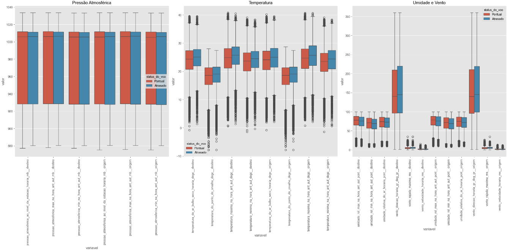

Como destacado inicialmente, este estudo se concentra em três companhias aéreas principais - Azul, Gol e Latam - que realizam a maioria dos voos domésticos no Brasil. O primeiro gráfico que gostaria de destacar é o da frequência anual de voos dessas companhias. É importante notar a redução drástica ocorrida em 2020 e 2021 devido à pandemia.  

 
<iframe width="900" height="800" frameborder="0" scrolling="no" src="//plotly.com/~mateusmoraesalmeida/85.embed"></iframe>
 

O próximo gráfico ilustra a quantidade de voos atrasados por ano. Essa é a variável que pretendemos prever, e é crucial salientar seu desequilíbrio, exigindo o uso de técnicas como SMOTE para balanceamento.  
 
<iframe width="900" height="800" frameborder="0" scrolling="no" src="//plotly.com/~mateusmoraesalmeida/87.embed"></iframe>
 

Analisando o volume de voos atrasados, observamos que a TAM teve o menor volume nos últimos cinco anos. No entanto, isso não implica necessariamente a maior pontualidade. 
 
<iframe width="900" height="800" frameborder="0" scrolling="no" src="//plotly.com/~mateusmoraesalmeida/91.embed"></iframe>
 

O indicador de pontualidade é calculado: 1−voos atrasados/voos realizados, mostra que a TAM avançou de terceiro para primeiro lugar entre 2019 e 2021 em termos de pontualidade (considerando as três empresas do estudo). A Gol, por outro lado, permaneceu em terceiro lugar desde 2019, com um indicador médio de 0,85.

 
<iframe width="900" height="800" src="//plotly.com/~mateusmoraesalmeida/93.embed"></iframe>
 

A análise mensal do indicador de pontualidade revela uma queda significativa durante os meses de férias - novembro, dezembro e janeiro - especialmente para as empresas GOL e TAM, com índices chegando a 0,70 e 0,73, respectivamente. A Azul se destaca por não ter registrado nenhum mês com indicador abaixo de 0,80, ao contrário da GOL, que teve 15 meses com indicadores inferiores nesse intervalo. 

 
<iframe width="900" height="800" src="//plotly.com/~mateusmoraesalmeida/96.embed"></iframe>
 

Além disso, o indicador de pontualidade pode ser usado para avaliar a pontualidade dos aeroportos no Brasil. O primeiro gráfico, um boxplot, ajuda a entender a distribuição dos valores de pontualidade nos aeroportos, com a maioria apresentando indicadores entre 0,87 e 0,91.  

 
<iframe width="900" height="800" src="//plotly.com/~mateusmoraesalmeida/98.embed"></iframe>
 

Por fim, gostaria de apresentar alguns gráficos de dados meteorológicos que são relevantes para a análise. 
 
<iframe width="900" height="800"  src="//plotly.com/~mateusmoraesalmeida/100.embed"></iframe>
 

 
<iframe width="900" height="800"  src="//plotly.com/~mateusmoraesalmeida/102.embed"></iframe>
 

O último gráfico mostra os resultados meteorológicos agrupados pelo status do voo (pontual ou atrasado). Apesar de haver diferenças sutis entre os voos que atrasaram e os que foram pontuais, os boxplots indicam que os dados meteorológicos podem não ser decisivos para melhorar a qualidade preditiva do modelo. 

 

[Para mais gráficos da análise acesse (plotly)](https://github.com/pedromateusalmeida/aviacao_brasileira/blob/main/scripts_v2/3_analise_exploratoria_pyspark.ipynb){ .md-button .md-button--primary }

[Para mais gráficos da análise acesse (seaborn)](https://github.com/pedromateusalmeida/aviacao_brasileira/blob/main/scripts_v2/3_2_analise_exploratoria.ipynb){ .md-button .md-button--primary }