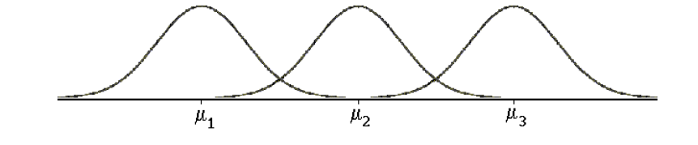
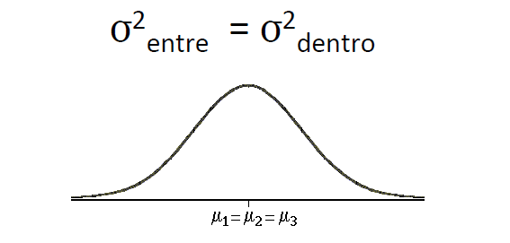
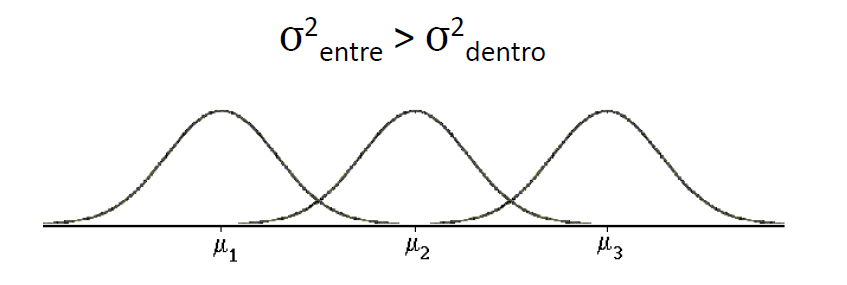

## O que é ANOVA?

ANOVA (Análise de Variância) é uma técnica estatística usada para comparar as médias de duas ou mais amostras independentes, determinando se existe uma diferença significativa entre elas. Em termos de seleção de recursos, ANOVA pode ser usada para avaliar se a média de uma variável numérica com uma variável categórica. É uma técnica estatística que nos permite fazer o seguinte teste de hipóteses: 
H0: as médias de duas ou mais populações são iguais. 
Ha: pelo menos uma das médias populacionais é diferente.  

Como objetivo do teste olhar variância de duas populações e ver se as médias dessas populações são iguais ou não. Para que isso aconteça é necessário: 
2. O desvio-padrão seja igual para todas as populações. Ou seja, se as populações tiverem médias diferentes, teremos: 

 
>

 
!!!tip "Dicas importantes"
    A ANOVA One-way é uma técnica para comparar médias usando amostras independentes
    Quando as amostras são dependentes, deve ser utilizada a ANOVA Two-way com efeito de blocos.
    Quando a suposição de normalidade dos dados não puder ser feita, existe a alternativa da ANOVA Não paramétrica
    (Teste de Kruskal-Wallis).

Síntese da ideia do ANOVA: 
comparar a variabilidade dentro dos grupos (σ2 dentro) com a variabilidade entre os grupos (σ2 entre)  

Se H0 for verdadeira, ou seja, as médias entre os grupos não são diferentes   
σ2 entre = σ2 dentro 

>

 

Se HA for verdadeira, isso quer dizer que as médias entre os grupos são diferentes 
σ2 entre > σ2 dentro 

>

## Como comparar σ2 dentro e σ2 entre ?

Para isto, precisaremos de uma Estatística de Teste 
F= S² entre/S²dentro 
Se F ≈ 1, então as médias não podem ser consideradas diferentes (não rejeitamos H0); 
Se F >> 1 (grandes), então podemos considerar que existem evidências de que as médias são diferentes (rejeitamos H0). 

!!!tip "Dicas importantes"
    •	F-Statistic (Estatística F): Esta é a razão entre a variância explicada pelo modelo (entre os grupos) e a variância não explicada (dentro dos grupos). Um valor alto de F indica que há uma diferença significativa entre as médias dos grupos. 
    •	P-valor (PR(>F)): Indica a probabilidade de observar um valor de F tão extremo quanto o observado, assumindo que a hipótese nula é verdadeira (ou seja, que todas as médias dos grupos são iguais). Um p-valor baixo (geralmente menor que 0,05) sugere que você deve rejeitar a hipótese nula. 
    •	Sum_sq (Soma dos Quadrados): Reflete a variância total, dividida em variância devido ao modelo (variância entre os grupos) e variância residual (variância dentro dos grupos). 
    •	df (Graus de Liberdade): Refere-se ao número de categorias nos dados menos um para a variância do modelo e ao número total de observações menos o número de categorias para a variância residual. 
    •	Normalidade: Verifique a normalidade dos dados. Se os dados não forem normalmente distribuídos, outras abordagens, como transformações ou testes não paramétricos (por exemplo, Kruskal-Wallis), podem ser necessárias. 
    •	Homogeneidade das Variâncias: Use testes como Levene ou Bartlett para verificar a homogeneidade das variâncias. Se as variâncias não forem homogêneas, considere usar ANOVA Welch. 

Quando Usar: O ANOVA é usado quando você quer comparar as médias de três ou mais grupos independentes. Por exemplo, comparar os efeitos de diferentes tratamentos ou condições em uma variável contínua.  

Quando Não Usar: Não use ANOVA se suas variáveis são dependentes, se tem menos de três grupos para comparar, ou se suas variáveis não são quantitativas. Além disso, não use ANOVA se as suposições do teste não forem atendidas. 

## Resumo

ANOVA testa a hipótese nula de que todas as médias de grupo são iguais contra a hipótese alternativa de que pelo menos uma média de grupo é diferente. Calcula a variância dentro dos grupos (variabilidade devido ao erro) e a variância entre os grupos (variabilidade devido ao efeito real). A razão dessas variâncias (F-ratio) é usada para determinar se as diferenças entre as médias são significativas.  

O teste ANOVA permite a avaliar a influência variáveis categóricas sobre uma variável contínua dois grupos ou mais grupos simultaneamente e ele é robusto contra pequenos desvios da normalidade na distribuição dos dados. Porém é um teste que pressupõe que os dados de cada grupo são normalmente distribuídos e têm variações iguais (homocedasticidade), se é robusto para pequenos desvios se mostra sensível para presença de outliers.  

# No Case

No contexto do case foi utilizado a variável dependente categórica status_do_voo (Pontual/Atrasado) e as variáveis númericas de meteorologia, por exemplo, precipitação, temperatura, umidade, pressão. 

[Aplicação do ANOVA no Case](https://github.com/pedromateusalmeida/aviacao_brasileira/blob/main/scripts_v2/4_3_feature_selection.ipynb){ .md-button .md-button--primary }

&nbsp;&nbsp;&nbsp;&nbsp;&nbsp;&nbsp;&nbsp;&nbsp;&nbsp;&nbsp;

## Referências

- [Link para o PDF sobre ANOVA - UFMG (Medicina)](https://www.est.ufmg.br/~enricoc/pdf/medicina/anova.pdf) 

- [Link para o PDF sobre ANOVA Avançado - UFMG (Medicina)](https://www.est.ufmg.br/~enricoc/pdf/avancados_medicina/anova.pdf) 

- [Repositório UFMG - TCC Mirelle Spindola](https://repositorio.ufmg.br/bitstream/1843/BUOS-B4GJYH/1/tcc___mirelle_spindola.pdf) 

- [Voitto - Artigo sobre ANOVA](https://www.voitto.com.br/blog/artigo/anova) 

- [USP - Tópico sobre ANOVA (PDF)](https://edisciplinas.usp.br/pluginfile.php/3260534/mod_resource/content/1/Tópico_13.pdf) 

- Material da especialização da UFMG 