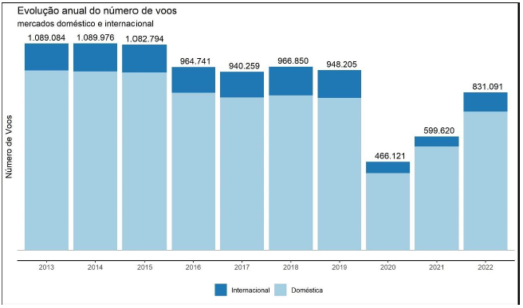
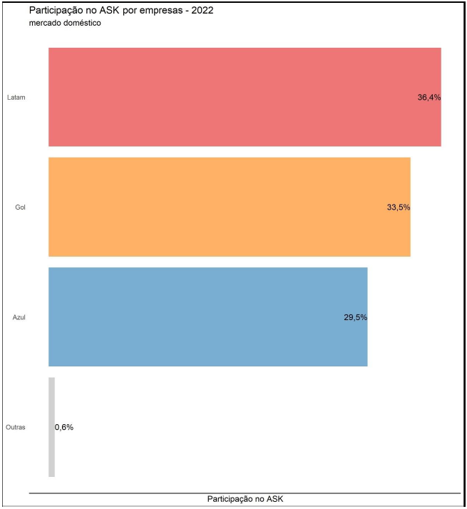

## Pontualidade da Aviação Brasileira

  Fig: Anuário do Transporte Aéreo

Nos últimos três anos, o mercado da aviação brasileira apresentou uma variedade de sinais de crescimento e recuperação, particularmente após os desafios enfrentados devido à pandemia de COVID-19.
 
 
Até o ano de 2022, o setor aéreo no Brasil mostrou uma recuperação significativa em seus principais indicadores. Em 2022, aproximadamente 831 mil voos foram realizados, tanto em rotas domésticas quanto internacionais, representando um aumento de 39% em relação a 2021. Nesse mesmo período, cerca de 98 milhões de passageiros foram transportados, evidenciando uma importante retomada após os impactos da pandemia.
 

  Fig: Anuário do Transporte Aéreo

 
Nos últimos cinco anos, três companhias aéreas principais - Azul, Gol e Latam - foram responsáveis por mais de 70% dos voos no Brasil, tanto nacionais quanto internacionais. Focando especificamente no mercado doméstico em 2022, essas três empresas foram responsáveis por mais de 95% dos voos. Assim, o setor de aviação se revela como uma área de significativa relevância, e no contexto brasileiro, observa-se a forte presença dessas três grandes empresas. Tendo em vista o contexto apresentado, o foco desse case será analisar as três principais companhias aéreas do mercado doméstico brasileiro.
 

  Fig: Anuário do Transporte Aéreo

## Indicador de Pontualidade

Outro ponto que gostaria de trazer para o case, e que está relacionado ao seu objetivo de criar um modelo que ajude a predizer se o voo vai atrasar ou não, é a metrica de pontualidade, um indicador de desempenho crucial no setor de aviação. Ela diferencia os serviços oferecidos pelas companhias aéreas e é altamente valorizada pelos passageiros que buscam chegar aos seus destinos conforme o horário programado. Além disso, manter um bom desempenho na pontualidade pode levar a economias de custo significativas para as companhias aéreas. O índice de pontualidade, conhecido como On Time Performance (OTP), considera o voo que pousa dentro de 14 minutos e 59 segundos do horário previsto de chegada. Este índice é essencial, pois atrasos podem afetar não apenas os passageiros, como também as operações de toda a cadeia de aviação. Assim, a pontualidade é um fator chave para o sucesso operacional e a satisfação do cliente no setor aéreo.
 
 
Calculo:  
Indicador de Pontualidade=1−voos atrasados/voos realizados
  
Interpretando o resultado: 
Ele está medindo a proporção de voos que estão no horário em relação ao total de voos realizados. O que podemos dizer sobre os resultados desse indicador:  
- Um valor próximo de 1 indica alta pontualidade, significando que a maioria dos voos está chegando ou partindo no horário. 
- Um valor mais baixo indica uma maior incidência de atrasos. 
- Se o indicador for 0, isso significa que todos os voos estão atrasados. 
  
Essa será uma métrica presente na nossa análise exploratória e que nos ajudará a tirar insights. Outro ponto a ser abordado nesse case é: ter mais dados é sempre benéfico para o modelo? Aqui, serão apresentados mais de uma versão do modelo, um utilizando poucos dados e outras versões utilizando mais dados, como dados meteorologicos do dia e da hora que o voo foi realizado. Ao aumentarmos o nível de informações, vamos esbarrar em problemas reais de Big Data, portanto, vou utilizar ferramentas adequadas para tanto. Prentendo aplicar as boas práticas de codificação, segmentação de script e na execução de cada etapa do projeto. 

## Referências

[ANAC - Setor aéreo brasileiro mostra forte recuperação de indicadores em 2022](https://www.gov.br/anac/pt-br/noticias/2023/setor-aereo-brasileiro-mostra-forte-recuperacao-de-indicadores-em-2022) 
[ANAC - Anuário Transporte Aéreo](https://www.gov.br/anac/pt-br/assuntos/dados-e-estatisticas/mercado-do-transporte-aereo/panorama-do-mercado/anuario-transporte-aereo) 
[AeroTD - A Importância da Pontualidade na Aviação](https://www.aerotd.com.br/decoleseufuturo/a-importancia-da-pontualidade-na-aviacao/) 
[Metropoles - Avianca é a aérea mais pontual do mundo; Azul fica em segundo lugar](https://www.metropoles.com/negocios/avianca-e-a-aerea-mais-pontual-do-mundo-azul-fica-em-segundo-lugar) 
[Panrotas - LATAM é a aérea mais pontual do Carnaval no Rio](https://www.panrotas.com.br/aviacao/empresas/2023/02/latam-e-a-aerea-mais-pontual-do-carnaval-no-rio_194936.html) 
[Panrotas - Aeroporto do Recife é top 5 em pontualidade em todo o mundo](https://www.panrotas.com.br/aviacao/pesquisas-e-estatisticas/2022/01/aeroporto-do-recife-e-top-5-em-pontualidade-em-todo-o-mundi_186642.html) 
[Kiosque da Aviação - LATAM Airlines é reconhecida como a companhia aérea mais pontual do mundo em 2021](https://kiosquedaaviacao.pt/latam-airlines-e-reconhecida-como-a-companhia-aerea-mais-pontual-do-mundo-em-2021/) 
[Época Negócios - Infraero mostra que GOL foi mais pontual em abril](https://epocanegocios.globo.com/Informacao/Resultados/noticia/2013/05/infraero-mostra-que-gol-foi-mais-pontual-em-abril.html) 

