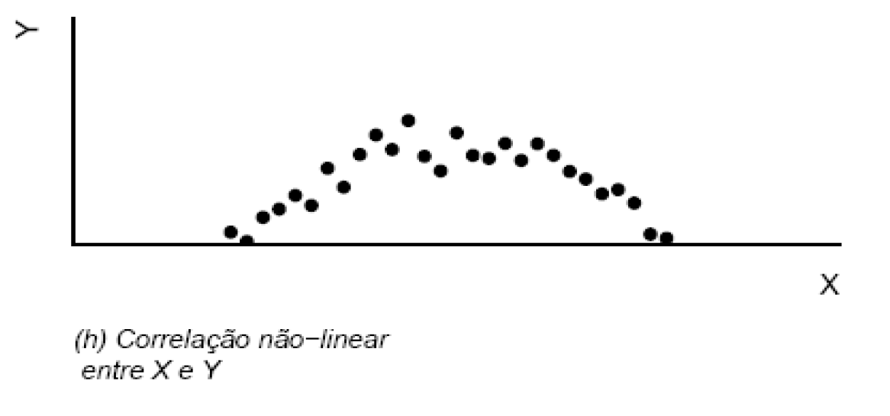
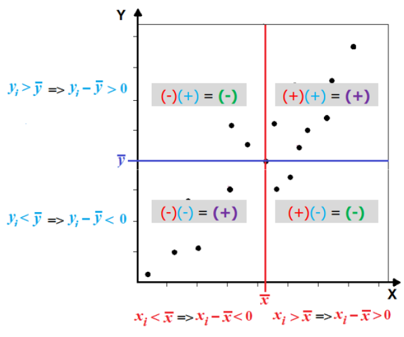

## O que é Análise de Correlação?

A Análise de Correlação é uma técnica estatística que avalia como as variáveis estão relacionadas entre si. Em termos de seleção de recursos, ela é usada para identificar características que têm forte correlação com a variável alvo. <br /><br />

O coeficiente de correlação (Pearson, Spearman ou Kendall) é calculado entre cada característica e a variável alvo.	Os resultados de alta correlação (positiva ou negativa) com a variável alvo são consideradas importantes. A técnica pode é utilizada para identifica multicolinearidade, se há redundância nas caractéristicas, se são relevantes, além de tudo é uma técnica simples e fácil de ser utilizada.   

Existem limitações na correlação que é o fato dela só captar relações lineares entre as variáveis, outros padrões ela não é capaz de identificar. Abaixo temos um gráfico entre duas variáveis X e Y, existe uma correlação entre elas, porém não linear isso não seria captado. 

!!!warning "Cuidados"
    •	Pode levar à exclusão de características importantes em relações não lineares. 
    •	Deve-se considerar o tipo de correlação a ser usado baseado na natureza dos dados. 
    •	Não descartar automaticamente características com baixa correlação, pois podem ser úteis em combinação com outras. 
    •	Avaliar a presença de outliers é essencial, pois eles podem ter um impacto significativo no coeficiente de correlação. 

## Teste de Correlação de Pearson

O coeficiente de correlação de Pearson é uma medida estatística que quantifica a relação linear entre duas variáveis quantitativas. É um dos métodos mais comuns para avaliar a força e a direção da associação linear entre variáveis contínuas. 

### Como Funciona o Teste de Correlação de Pearson

<strong>Cálculo do Coeficiente:</strong> O coeficiente de Pearson (denotado como r) varia entre -1 e 1. Um valor de r = 1 indica uma correlação positiva perfeita, r = -1 indica uma correlação negativa perfeita, e r = 0 significa que não há correlação linear. 
<strong>Fórmula:</strong> O coeficiente de Pearson é calculado como a covariância das variáveis dividida pelo produto dos seus desvios padrão. 
<strong>Significância Estatística:</strong> Testes estatísticos podem ser usados para avaliar se o coeficiente de correlação é significativamente diferente de zero, indicando uma relação linear significativa. 

!!!tip "Dicas"
    •	rXY é uma estatística adimensional(semunidadede medida); 
    •	rXY é apropriadoquandoX e Y sãovariáveisquantitativas; 
    •	rXY é o mesmoquer YX(rótulosX e Y intercambiáveis); 
    •	Pode ser influenciado por valores atípicos. 

O sinal do coeficiente de correlação linear de Pearson afeta diretamente o desenho do gráfico. Abaixo um temos um exemplo dos sinais e qual é a sua localização plano cartesiano de X e Y. 

!!!danger "Cuidados"
    Correlação não implica causalidade. Uma correlação significativa entre duas variáveis não significa que uma causa a outra.

 
Fonte: Material da pós graduação da UFMG. 

### Quando utilizar?

<strong>Dados Contínuos:</strong> Adequado para dados quantitativos contínuos. 
<strong>Relações Lineares:</strong> Utilizado quando se suspeita que a relação entre as variáveis é linear. 
<strong>Análise Exploratória:</strong> Comumente usado na análise exploratória de dados para identificar relações potenciais entre variáveis. 

!!!tip "Dicas"
    

     
    Fonte: Material da pós graduação da UFMG. 
    

## No case

No case foi utilizado a correlação de pearson na etapa da análise explortatória. Nesse primeiro momento ela foi utilizada com a finalidade de visualizar potenciais correlações entre as colunas. 

[Aplicação da correlação de pearson no Case](https://github.com/pedromateusalmeida/aviacao_brasileira/blob/main/scripts_v2/3_2_analise_exploratoria.ipynb){ .md-button .md-button--primary }

&nbsp;&nbsp;&nbsp;&nbsp;&nbsp;&nbsp;&nbsp;&nbsp;&nbsp;&nbsp;

## Referências

- [How can I simply prove that the Pearson correlation coefficient is between -1 and 1? - Math Stack Exchange](https://math.stackexchange.com/questions/564751/how-can-i-simply-prove-that-the-pearson-correlation-coefficient-is-between-1-an)
- [Article on Pearson correlation - SAGE Journals](https://journals.sagepub.com/doi/10.1177/8756479308317006)
- [Correlação Pearson, Spearman, Kendall - Universidade Federal de Santa Catarina](https://www.inf.ufsc.br/~vera.carmo/Correlacao/Correlacao_Pearson_Spearman_Kendall.pdf)
- [Coeficiente de correlação de Pearson - Wikipedia](https://pt.wikipedia.org/wiki/Coeficiente_de_correla%C3%A7%C3%A3o_de_Pearson)

