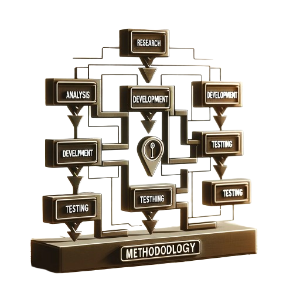
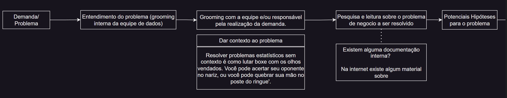
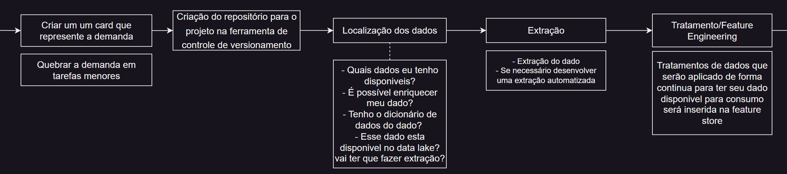
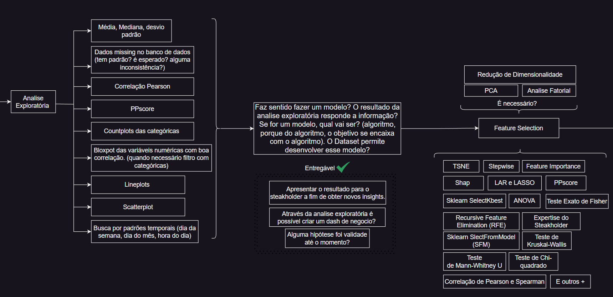
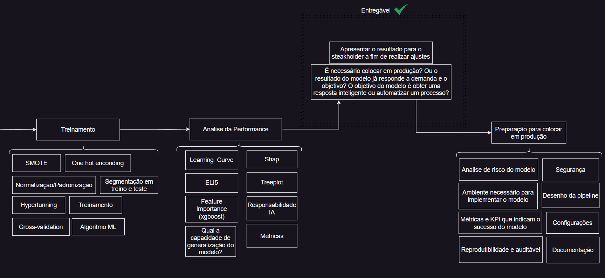

## Metodologia de Trabalho

 
Quando lido com um problema gosto de resolve-lo colocando em uma “esteira”.  Queria fazer um curto destaque que é: a esteira pode ser mais curta ou mais longa vai depender se o problema é uma demanda ou um projeto. Dito isso, a primeira etapa consiste em receber a demanda, fazer uma grooming com a equipe de dados e depois com a equipe que realizou a demanda. Essa etapa pode ser feita em conjunto para economizar tempo ou separada visando promover maior alinhamento entre a equipe e de aumentar o campo de possibilidades para se resolver o problema através de um brainstorm.   
  
Após dar contexto ao problema e entendê-lo melhor é a fase de pesquisar sobre o assunto, buscar por informações, notícias, artigos científicos e outros dados que possam contribuir o entendimento ou resolução do problema. Após essa etapa faço levantamento de potenciais hipóteses para o problema e possíveis soluções. Abaixo uma imagem que ilustra essas primeiras etapas:  

  Fig: Fluxograma da metodologia de trabalho utilizada no case

 
Após a execução dessas etapas daria início a documentação do projeto, crio um card na ferramenta de Kanbam com a demanda apresentada. Dentro desse card crio subcards com etapas necessárias para atingir o sucesso card principal. Nesse card faria o registro do andamento do projeto, decisões tomadas até a sua conclusão, posteriormente o que está sendo escrito será utilizado na produção da documentação final do projeto ou case.  
 
Criar um repositório em uma ferramenta de versionamento para armazenar o progresso desse projeto a nível de código. A etapa seguinte é localizar os dados, nesse momento é hora de olhar para os dados que estão disponíveis internamente no data lake da empresa e outros dados que estão disponíveis na internet, por exemplo, no próprio site da ANAC. E refletir se o fato de os dados estarem na internet o seu consumo é facilitado, confiável, se é possível automatizar sua extração e a sua utilização na tomada de decisão não fere nenhuma das regras da LGPD. 
 
Localizado os dados é o momento de extrair e depois tratar os dados. A etapa de tratamento é crucial para garantir qualidade nos dados que serão utilizados na análise e/ou no treinamento do modelo. Nessa etapa também identificamos as informações que demandarão tratamento continuo e precisarão ser disponibilizadas na feature store. Abaixo uma imagem que ilustra essas etapas. 

  Fig: Fluxograma da metodologia de trabalho utilizada no case

 
A próxima fase seria a análise exploratória, nela realizamos diversas análises descritivas e de inferências. E nessa etapa já buscamos responder algumas hipóteses. Há situações em que o resultado da análise exploratória resulte em uma conclusão de que um modelo não é necessário e que um dashboard resolverá o nosso problema.  
 
O problema evoluindo para uma resolução que utiliza um modelo de aprendizado de máquina, nós vamos evoluir para próxima etapa a de feature selection. Nesse momento aplicamos diversas técnicas que nos auxilia na escolha das melhores variáveis para o modelo e é o momento de aplicar técnicas de redução de dimensionalidade para sintetizar uma dimensão, ou então criar um índice que represente uma determinada característica.  Abaixo uma imagem que representa esse fluxo 

  Fig: Fluxograma da metodologia de trabalho utilizada no case

 
Passa essas etapas é o momento de treinar o modelo e logo em seguida analisar sua performance. Dentro da etapa de treinamento do modelo temos umas sub etapas que são importantes para o processo, por exemplo, one hot enconding, balanceamento de variável preditiva (SMOTE), normalização dos dados, hypertunning, cross-validation e pitras. E na etapa de análise olhamos a performance do modelo, analisamos se faz sentido, quais os pesos das variáveis para predizer a variável y do modelo, se o modelo não está cometendo nenhuma infração (por exemplo, se não está gerando nenhum viés discriminatório) e outras análises.  
 
Após o desenvolvimento do modelo, análise de performance e apresentação para o time ou stakeholder interessado no projeto algumas perguntas precisam ser respondidas, por exemplo, o resultado apresentado atingiu o objetivo? É necessário automatizar o modelo? O objetivo final do modelo é automatizar um processo ou auxiliar no processo de uma tomada de decisão mais inteligente? Essas perguntas ajudaram a compreender a necessidade e a urgência de se colocar um modelo em produção.   
 
Tanto se o modelo for para produção, quanto se ele não for será necessário criar uma documentação para ele. Se for para produção seria importante já elaborar algumas métricas que ajudem a medir o sucesso do modelo e sua performance, documentar o ambiente necessário para o modelo funcionar.  Essas informações serão necessárias para o engenheiro de MLops para colocar em produção o modelo. Abaixo uma imagem que ilustra essas etapas  

  Fig: Fluxograma da metodologia de trabalho utilizada no case

 

## Referências

- [Introducing MLOps How to Scale Machine Learning in the Enterprise - Editora O'Reilly](https://www.oreilly.com/library/view/introducing-mlops/9781492083290/)
- [Pratical MLops - Editora O'Reilly](https://www.oreilly.com/library/view/practical-mlops/9781098103002/)
- [A Construção do Saber (Manual de metodologia de pesquisa em ciência humanas)[ Christian Laville e Jean Diome]]()
- 