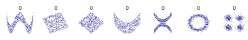

### O que é PPScore?

O Predictive Power Score (PPScore) é uma métrica alternativa à correlação que quantifica a relação entre duas variáveis, levando em conta não apenas relações lineares, mas também padrões mais complexos. Ele pode ser usado para identificar relações unidirecionais e não lineares entre duas variáveis. Resumindo a pontuação de poder preditivo é uma pontuação assimétrica e independente do tipo de dados que pode detectar relações lineares ou não lineares entre duas colunas. A pontuação varia de 0 (sem poder preditivo) a 1 (poder preditivo perfeito)  

 
Fig: Exemplos padrões não lineares

### Como Funciona

•	O PPScore mede a capacidade de uma variável (X) prever outra variável (Y) através de um modelo de machine learning. 
•	Um modelo é construído para prever Y a partir de X e o desempenho do modelo é comparado com um modelo simples (naive model). 

!!!tip "Aplicabilidade"
    •	Útil para identificar relações não lineares e unidirecionais entre variáveis. 
    •	Pode ser usado em qualquer tipo de variável (numérica ou categórica). 
    •	Útil para seleção de recursos e análise exploratória de dados. 

### Interpretação

Um PPScore alto indica que a característica tem um forte poder preditivo para a variável alvo e já um baixo sugere que a característica tem pouco ou nenhum poder preditivo. Apesar do PPScore ser extremamente útil para É importante avaliar identificar relações não lineares e unidirecionais entre variáveis, este carece de ser feito em conjunto com outras análises, como a de correlação e a importância de recursos, para obter uma visão holística das relações nos dados, evitando assim conclusões errôneas.  

O PPScore é versátil para diferentes tipos de dados, incluindo variáveis numéricas e categóricas. E por fim não menos importante, temos que destacar que o PPScore demandar mais computacionalmente se compararmos com o cálculo de correlação, pois envolve a construção de modelos preditivos e dependendo do modelo utilizado para calcular o PPScore, pode ser sensível a overfitting, especialmente em conjuntos de dados menores. 

!!!tip "Visualização do resultado"
    Gráficos de matriz de PPScore podem ser úteis para visualizar as relações entre múltiplas variáveis de um conjunto de dados. 

## No case

No case o PPScore foi utilizado na etapa da análise explortatória. Nesse primeiro momento ela foi utilizada com a finalidade de visualizar potenciais correlações entre as colunas. 

[Aplicação do PPScore no Case](https://github.com/pedromateusalmeida/aviacao_brasileira/blob/main/scripts_v2/3_2_analise_exploratoria.ipynb){ .md-button .md-button--primary }

## Referências

- [ppscore - GitHub](https://github.com/8080labs/ppscore) 
- [Predictive Power Score vs Correlation - Kaggle](https://www.kaggle.com/code/frtgnn/predictive-power-score-vs-correlation) 
- [The Predictive Power Score - MacroSynergy Research](https://research.macrosynergy.com/the-predictive-power-score/) 
- [An Alternative to Correlation: Predictive Power Score in Python - Medium (Geek Culture)](https://medium.com/geekculture/an-alternative-to-correlation-predictive-power-score-in-python-a3160c95d701) 
- [Predictive Power Score Implementation in Python - Medium (Geek Culture)](https://medium.com/geekculture/predictive-power-score-implementation-in-python-70558bf91f45) 
- [RIP Correlation: Introducing the Predictive Power Score - Towards Data Science](https://towardsdatascience.com/rip-correlation-introducing-the-predictive-power-score-3d90808b9598) 

